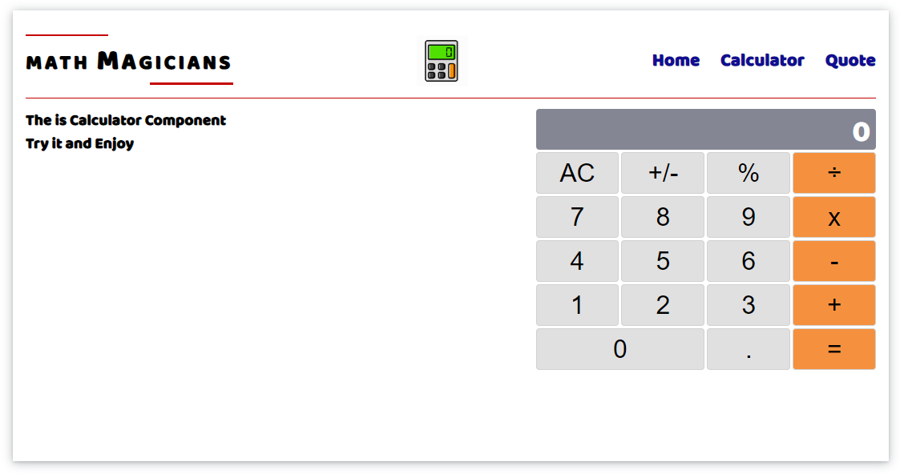

# React - Math Magicians (Calculator)


# Math Magicians

> This application use React framework to implement a calculator function.

## Built With

- React 
- JS


## Technologies

- webpack.
- JS6 Module.

## Live Demo 

#### Go to live demo : 
- https://maenkhraisha.github.io/math-magicians-2/
- https://math-magician-maen.herokuapp.com/



## out resourse

## Getting Started


**First open VS code**<br/>
**From the VS code terminal navigate to the folder where you want to download the project**<br/>
```
$ git clone git@github.com:maenkh/math-magician.git
```
```
use npm install
```
```
use npm start
```


### Prerequisites
VScode


## Authors

👤 **Maen Al-khraisha**

- GitHub: [@githubhandle](https://github.com/maen1980)
- Twitter: [@twitterhandle](https://twitter.com/AlkhryshaM)
- LinkedIn: [LinkedIn](https://www.linkedin.com/in/ma-en-mohammad-303930100/)


## 🤝 Contributing

Contributions, issues, and feature requests are welcome!

Feel free to check the [issues page](../../issues/).

## Show your support

Give a ⭐️ if you like this project!

## Acknowledgments


## 📝 License

This project is [MIT](./MIT.md) licensed.
